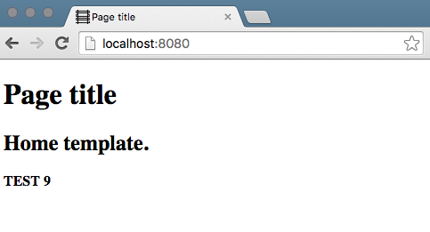
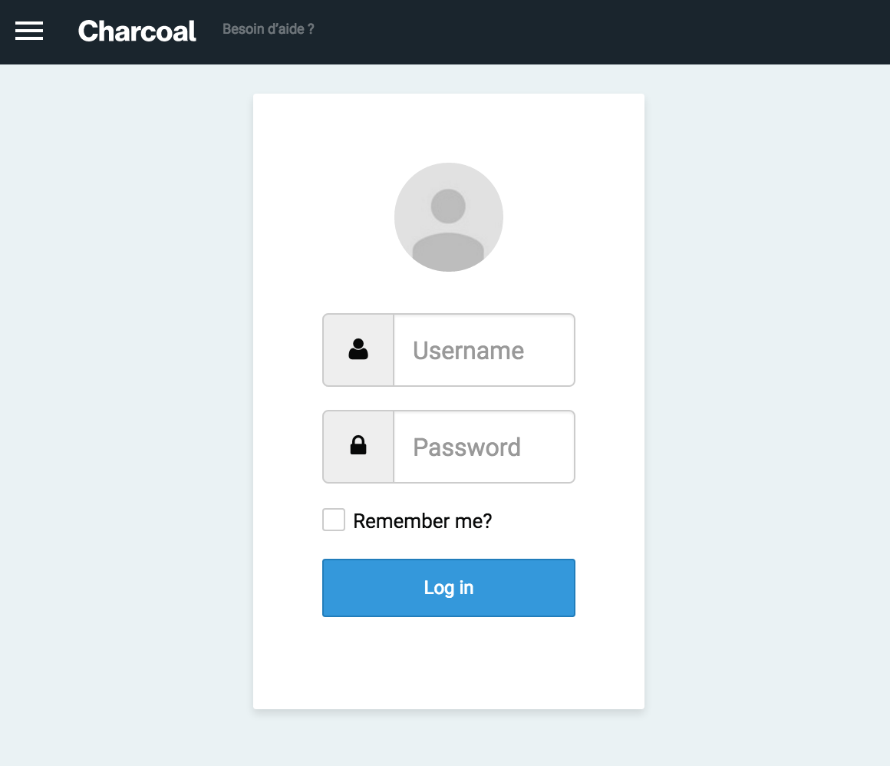

Charcoal Project Boilerplate
============================

The goal of this project is to provide a fully working "boilerplate" (empty _skeleton_ project) using the Charcoal framework.

# Table of Content

- [How to Install](#how-to-install)
    - [1. Create / clone the project boilerplate](#1-create-clone-the-project-boilerplate)
    - [2. Rename the boilerplate to your project](#2-rename-the-boilerplate-to-your-project)
    - [3. Test your installation](#3-test-your-installation)
    - [4. Set up database storage](#4-set-up-database-storage)
    - [5. Set up `charcoal-admin`](#5-set-up-charcoal-admin)
- [Going further](#going-further)
    - More config customizations
   - Creating a custom template
   - Using objects
   - Customizing the backend
- [Dependencies and requirements](#dependencies-and-requirements)
    - [The charcoal modules](#the-charcoal-modules)
- What's inside the Boilerplate
- [Development](#development)
    + [Development dependencies](#development-dependencies)
    + [Continuous Integration](#continuous-integration)
    + [Coding Style](#coding-style)
    + [Authors](#authors)
    + [Changelog](#changelog)

# How to Install

To start a Charcoal project with this Boilerplate, simply:

## 1. **Create / clone the project boilerplate**

```shell
$ composer create-project locomotivemtl/charcoal-project-boilerplate:@dev --prefer-source
```

> **About the Document Root**
>
> 👉 The project should not be cloned directly in a web-accessible directory. The web server should be configured to serve the `www/` folder directly. The other folders (`vendor/`, `src/`, `templates/`, `metadata/`, `config/`, etc.) should therefore not be available from the web server (kept outside the document root).


## 2. **Rename the boilerplate to your project**

**This step must be done manually.** Ensure to change **all** references to "boilerplate" and "Boilerplate" to your project name. (Make sure to look in the `src`, `metadata` and `templates` folders). Also rename the `metadata/boilerplate`, `src/Boilerplate` and `templates/boilerplate` folders to match your project.

> 👉 Do not forget to change the "Boilerplate" reference in `composer.json`. To ensure the autloader is still working, run the following command after renaming:
>
> ```shell
> $ composer dump-autoload
> ```

## 3. **Test your installation**

A quick server can be started using the PHP builtin server:

```shell
$ cd www
$ php -S localhost:8080
```

Point your browser to `http://localhost:8080/` and you should see the boilerplate's default home page.



How to change the default page and add routes/templates is explained later in this README.

## 4. **Set up a database storage**

The next step requires a custom configuration file. It is recommended to use `config/config.local.json` and making sure it is not committed to source control:

```shell
$ cp config/config.sample.json config/config.local.json
$ echo -n "config/config.local.json" >> .gitignore
```

Create an empty database and ensure a SQL user has the proper permissions for this database. Then edit the `config/config.local.json` file with this information.

```json
{
    "databases": {
        "default": {
            "type": "mysql",
            "hostname": "127.0.0.1",
            "database": "foobar",
            "username": "foo_bar",
            "password": "F00$BâR123"
        }
    },
    "default_database": "default"
}
```

## 5. **Set up charcoal-admin**

First, ensure the admin module (the _backend_) is properly set up and ready:

```shell
$ cd vendor/locomotivemtl/charcoal-admin
$ npm install
$ bower install
$ grunt
$ cd -
```

Then create the first admin user, to be able to login into the backend:

```shell
$ ./vendor/bin/charcoal admin/user/create
```

> 👉 The `./vendor/bin/charcoal` CLI tool, provided by `charcoal-app` is required to run various scripts, many of which are provided by the `charcoal-admin` and `charcoal-base` modules.

Point your browser to http://localhost:8080/ and you should see the boilerplate's default home page.



The next step to customize the _backend_ is to configure the main menu, as well as the various

# Dependencies and Requirements

- [`PHP 5.5+`](http://php.net)
    + `ext-json`
    + `ext-pdo`
    + `ext-spl`
    + `ext-mbstring`

## The Charcoal modules

- [charcoal-admin](https://github.com/locomotivemtl/charcoal-admin)
    + The backend, or control panel.
- [charcoal-app](https://github.com/locomotivemtl/charcoal-app)
    + App components based on Slim.
- [charcoal-base](https://github.com/locomotivemtl/charcoal-base)
    + Base objects and behaviors.
- [charcoal-cms](https://github.com/locomotivemtl/charcoal-cms)
    + CMS objects (Section, News, Events, etc.)
- [charcoal-core](https://github.com/locomotivemtl/charcoal-core)
    + Core objects, Model, Source.
- [charcoal-config](https://github.com/locomotivemtl/charcoal-config)
    + Base configuration system.
- [charcoal-email](https://github.com/locomotivemtl/charcoal-email)
    + Email utilities, based on phpmailer.
- [charcoal-factory](https://github.com/locomotivemtl/charcoal-factory)
    + Dynamic objects creation.
- [charcoal-image](https://github.com/locomotivemtl/charcoal-image)
    + Image manipulation and effects.
- [charcoal-property](https://github.com/locomotivemtl/charcoal-property)
    + Metadata's properties.
- [charcoal-translation](https://github.com/locomotivemtl/charcoal-translation)
    + Translation utilities.
- [charcoal-ui](https://github.com/locomotivemtl/charcoal-ui)
    + Ui objects (Form, Menu, Dashboard, Layout, etc.)
- [charcoal-view](https://github.com/locomotivemtl/charcoal-view)
    + View renderer. (mustache, twig, etc.)

### Status matrix

| Module                   | Version | Travis | Scrutinizer | Insights | Coveralls | PHPDoc | ApiGen |
| ------------------------ | ------- | ------ | ----------- | -------- | --------- | ------ | ------ |
| **admin**       |  | [](https://travis-ci.org/locomotivemtl/charcoal-admin) | [](https://scrutinizer-ci.com/g/locomotivemtl/charcoal-admin/?branch=master) | [](https://insight.sensiolabs.com/projects/00402be5-f8bb-4279-89b8-3e1e3248178a) | [](https://coveralls.io/github/locomotivemtl/charcoal-admin?branch=master)  | [PHPDoc](http://locomotivemtl.github.io/charcoal-admin/docs/master/) | [ApiGen](http://locomotivemtl.github.io/charcoal-admin/apigen/master/) |
| **app**         |  | [](https://travis-ci.org/locomotivemtl/charcoal-app) | [](https://scrutinizer-ci.com/g/locomotivemtl/charcoal-app/?branch=master) | [](https://insight.sensiolabs.com/projects/533b5796-7e69-42a7-a046-71342146308a) | [](https://coveralls.io/github/locomotivemtl/charcoal-app?branch=master) | [PHPDoc](http://locomotivemtl.github.io/charcoal-app/docs/master/) | [ApiGen](http://locomotivemtl.github.io/charcoal-app/apigen/master/) |
**base**        |  | [](https://travis-ci.org/locomotivemtl/charcoal-base) | [](https://scrutinizer-ci.com/g/locomotivemtl/charcoal-base/?branch=master) | [](https://insight.sensiolabs.com/projects/76dc07e1-1a2c-4fed-b7fa-030f18648c51) | [](https://coveralls.io/github/locomotivemtl/charcoal-base?branch=master)  | [PHPDoc](http://locomotivemtl.github.io/charcoal-base/docs/master/) | [ApiGen](http://locomotivemtl.github.io/charcoal-base/apigen/master/) |
| **cms**         |  | [](https://travis-ci.org/locomotivemtl/charcoal-cms) | [](https://scrutinizer-ci.com/g/locomotivemtl/charcoal-cms/?branch=master) | [](https://insight.sensiolabs.com/projects/44d8d264-207b-417d-bcbd-dd52274fc201) | [](https://coveralls.io/github/locomotivemtl/charcoal-cms?branch=master)  | [PHPDoc](http://locomotivemtl.github.io/charcoal-cms/docs/master/) | [ApiGen](http://locomotivemtl.github.io/charcoal-cms/apigen/master/) |
| **config**      |  | [](https://travis-ci.org/locomotivemtl/charcoal-config) | [](https://scrutinizer-ci.com/g/locomotivemtl/charcoal-config/?branch=master) | [](https://insight.sensiolabs.com/projects/27ad205f-4208-4fa6-9dcf-534b3a1c0aaa) | [](https://coveralls.io/github/locomotivemtl/charcoal-config?branch=master)  | [PHPDoc](http://locomotivemtl.github.io/charcoal-config/docs/master/) | [ApiGen](http://locomotivemtl.github.io/charcoal-config/apigen/master/) |
| **core**     |  | [](https://travis-ci.org/locomotivemtl/charcoal-core) | [](https://scrutinizer-ci.com/g/locomotivemtl/charcoal-core/?branch=master) | [](https://insight.sensiolabs.com/projects/ab15f6b0-2063-445e-81d7-2575b919b0ab) | [](https://coveralls.io/github/locomotivemtl/charcoal-core?branch=master) | [PHPDoc](http://locomotivemtl.github.io/charcoal-core/docs/master/) | [ApiGen](http://locomotivemtl.github.io/charcoal-core/apigen/master/) |
| **email**       |  | [](https://travis-ci.org/locomotivemtl/charcoal-email) | [](https://scrutinizer-ci.com/g/locomotivemtl/charcoal-email/?branch=master) | [](https://insight.sensiolabs.com/projects/54058388-3b5d-47e3-8185-f001232d31f7) | [](https://coveralls.io/github/locomotivemtl/charcoal-email?branch=master) | [PHPDoc](http://locomotivemtl.github.io/charcoal-email/docs/master/) | [ApiGen](http://locomotivemtl.github.io/charcoal-email/apigen/master/) |
| **factory**   |  | [](https://travis-ci.org/locomotivemtl/charcoal-factory) | [](https://scrutinizer-ci.com/g/locomotivemtl/charcoal-factory/?branch=master) | [](https://insight.sensiolabs.com/projects/0aec930b-d696-415a-b4ef-a15c1a56509e) | [](https://coveralls.io/github/locomotivemtl/charcoal-factory?branch=master)  | [PHPDoc](http://locomotivemtl.github.io/charcoal-factory/docs/master/) | [ApiGen](http://locomotivemtl.github.io/charcoal-factory/apigen/master/) |
| **image**    |  | [](https://travis-ci.org/locomotivemtl/charcoal-image) | [](https://scrutinizer-ci.com/g/locomotivemtl/charcoal-image/?branch=master) | [](https://insight.sensiolabs.com/projects/87c9621d-3b2e-4e71-a42f-e69ebca4672e) | [](https://coveralls.io/github/locomotivemtl/charcoal-image?branch=master)  | - | - |
| **property**  |  | [](https://travis-ci.org/locomotivemtl/charcoal-property) | [](https://scrutinizer-ci.com/g/locomotivemtl/charcoal-property/?branch=master) | [](https://insight.sensiolabs.com/projects/f3bdff38-c300-4207-8342-da002e64a6e1) | [](https://coveralls.io/github/locomotivemtl/charcoal-property?branch=master) | [PHPDoc](http://locomotivemtl.github.io/charcoal-property/docs/master/) | [ApiGen](http://locomotivemtl.github.io/charcoal-property/apigen/master/) |
| **translation** |  | [](https://travis-ci.org/locomotivemtl/charcoal-translation) | [](https://scrutinizer-ci.com/g/locomotivemtl/charcoal-translation/?branch=master) | [](https://insight.sensiolabs.com/projects/fa44d2ed-99b7-4fb1-99a1-a4a9b7acb986) | [](https://coveralls.io/github/locomotivemtl/charcoal-translation?branch=master)  | - | - |
| **ui**       |  | [](https://travis-ci.org/locomotivemtl/charcoal-ui) | [](https://scrutinizer-ci.com/g/locomotivemtl/charcoal-ui/?branch=master) | [](https://insight.sensiolabs.com/projects/ad5d1699-07cc-45b5-9ba4-9b3b45f677e0) | [](https://coveralls.io/github/locomotivemtl/charcoal-ui?branch=master)  | [PHPDoc](http://locomotivemtl.github.io/charcoal-ui/docs/master/) | [ApiGen](http://locomotivemtl.github.io/charcoal-ui/apigen/master/) |
| **view**    |  | [](https://travis-ci.org/locomotivemtl/charcoal-view) | [](https://scrutinizer-ci.com/g/locomotivemtl/charcoal-view/?branch=master) | [](https://insight.sensiolabs.com/projects/396d2f06-82ba-4c79-b8cc-762f1e8bda29) | [](https://coveralls.io/github/locomotivemtl/charcoal-view?branch=master)  | - | - |


# What's inside this Boilerplate?

Like all Charcoal projects / modules, the main components are:

- **Autoloader**
    - Provided by Composer.
- **Config**
    - As JSON or PHP files in the [`config/`](config/) directory.
    - Use [`locomotivemtl/charcoal-config`](https://github.com/locomotivemtl/charcoal-config)
- **Front Controller**
    - See [`www/.htaccess`](www/.htaccess) and [`www/index.php`](www/index.php) for details.
    - Route dispatcher
- **Script Controller (Charoal Binary)**
    - Installed from `charcoal-app` as `vendor/bin/charcoal`.
- **PHP scripts**
    - PSR-1, PSR2 and PSR-4 compliant scripts are located in [`src/`](src/)
    - There are typically 3 types of controllers:
        - _Templates_
        - _Actions_
        - _Scripts_
    - ... 2 types of object
        - Objects based on _Content_
        - Objects based on _UserData_
    - ... and all other types of scripts (services, helpers, configs, factories, etc.)
- **Assets**
    - Assets are files required to be on the webserver root
    - Scripts, in `src/scripts/` and compiled in `www/assets/scripts/`
    - Styles , with Sass in `src/styles/` and compiled CSS in `www/assets/styles/`
    - Images, in `www/assets/images/`


# Development

To install the development environment:

```shell
★ composer install --prefer-source
```

To run the scripts (phplint, phpcs and phpunit):

```shell
★ composer test
```

## API documentation

- The auto-generated `phpDocumentor` API documentation is available at [https://locomotivemtl.github.io/charcoal-base/docs/master/](https://locomotivemtl.github.io/charcoal-base/docs/master/)
- The auto-generated `apigen` API documentation is available at [https://codedoc.pub/locomotivemtl/charcoal-base/master/](https://codedoc.pub/locomotivemtl/charcoal-base/master/index.html)

## Development dependencies

- `phpunit/phpunit`
- `squizlabs/php_codesniffer`
- `satooshi/php-coveralls`

## Continuous Integration

| Service | Badge | Description |
| ------- | ----- | ----------- |
| [Travis](https://travis-ci.org/locomotivemtl/charcoal-base) | [](https://travis-ci.org/locomotivemtl/charcoal-base) | Runs code sniff check and unit tests. Auto-generates API documentation. |
| [Scrutinizer](https://scrutinizer-ci.com/g/locomotivemtl/charcoal-base/) | [](https://scrutinizer-ci.com/g/locomotivemtl/charcoal-base/?branch=master) | Code quality checker. Also validates API documentation quality. |
| [Coveralls](https://coveralls.io/github/locomotivemtl/charcoal-base) | [](https://coveralls.io/github/locomotivemtl/charcoal-base?branch=master) | Unit Tests code coverage. |
| [Sensiolabs](https://insight.sensiolabs.com/projects/533b5796-7e69-42a7-a046-71342146308a) | [](https://insight.sensiolabs.com/projects/533b5796-7e69-42a7-a046-71342146308a) | Another code quality checker, focused on PHP. |

## Coding Style

The charcoal-base module follows the Charcoal coding-style:

- [_PSR-1_](https://github.com/php-fig/fig-standards/blob/master/accepted/PSR-1-basic-coding-standard.md)
- [_PSR-2_](https://github.com/php-fig/fig-standards/blob/master/accepted/PSR-2-coding-style-guide.md)
- [_PSR-4_](https://github.com/php-fig/fig-standards/blob/master/accepted/PSR-4-autoloader.md), autoloading is therefore provided by _Composer_.
- [_phpDocumentor_](http://phpdoc.org/) comments.
- Read the [phpcs.xml](phpcs.xml) file for all the details on code style.

> Coding style validation / enforcement can be performed with `composer phpcs`. An auto-fixer is also available with `composer phpcbf`.

# Authors

- Mathieu Ducharme, mat@locomotive.ca

# Changelog

_Unreleased_
